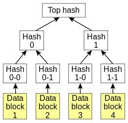

# 1.Trie树   
  Trie树又称字典树，单词查找树或者前缀树，是一种用于快速检索的多叉树结构，如英文字母的字典树是一个26叉树，数字的字典树是一个10叉树。   
  Trie树可以利用字符串的公共前缀来节约存储空间。如下图所示，该trie树用10个节点保存了6个字符串tea，ten，to，in，inn，int：     
      
  在该trie树中，字符串in，inn和int的公共前缀是“in”，因此可以只存储一份“in”以节省空间。当然，如果系统中存在大量字符串且这些字符串基本没有公共前缀，则相应的trie树将非常消耗内存，这也是trie树的一个缺点。   
  Trie树的基本性质可以归纳为：   
（1）根节点不包含字符，除根节点意外每个节点只包含一个字符。   
（2）从根节点到某一个节点，路径上经过的字符连接起来，为该节点对应的字符串。   
（3）每个节点的所有子节点包含的字符串不相同。   
# 2.Patricia树
 Patricia树，或称Patricia trie，压缩前缀树，是一种更节省空间的Trie。对于基数树的每个节点，如果该节点是唯一的儿子的话，就和父节点合并。    
       
# 3.Merkle树
Merkle Tree，通常也被称作Hash Tree，顾名思义，就是存储hash值的一棵树。Merkle树的叶子是数据块(例如，文件或者文件的集合)的hash值。非叶节点是其对应子节点串联字符串的hash。    
   
Merkle Tree的主要作用是当拿到Top Hash的时候，这个hash值代表了整颗树的信息摘要，当树里面任何一个数据发生了变动，都会导致Top Hash的值发生变化。 而Top Hash的值是会存储到区块链的区块头里面去的， 区块头是必须经过工作量证明。 这也就是说我只要拿到一个区块头，就可以对区块信息进行验证。

# 4.MPT（Merkle Patricia Tree）树
 知道了Merkle Tree，知道了Patricia Tree，顾名思义，MPT（Merkle Patricia Tree）就是这两者混合后的产物。    
 在以太坊（ethereum）中，使用了一种特殊的十六进制前缀(hex-prefix, HP)编码，所以在字母表中就有16个字符。这其中的一个字符为一个nibble(半字节)。    
 
 MPT树中的节点包括空节点、叶子节点、扩展节点和分支节点:    
- **空节点:** 简单的表示空，在代码中是一个空串。    
- **叶子节点(Leaf):** 表示为[key,value]的一个键值对，其中key是去除前缀剩余key的半字节编码，value是value的RLP编码。     
- **扩展节点(Extention):** 也是[key，value]的一个键值对， 第一个字段是剩下的Key的可以至少被两个剩下节点共享的部分的半字节编码，value值存储的是扩展出的分支节点的hash值（sha3（RLP（分支节点数据List））），这个hash可以被用来查询数据库中的节点。也就是说通过hash链接到其他节点。    
- **分支节点(Branch):** 分支节点包含了17个字段，前16个元素对应着key中的16个可能的十六进制字符。第17个字段是存储那些在当前结点结束了的节点(例如， 有三个key,分别是 (abc ,abd, ab) 第17个字段储存了ab节点的值)，即分支节点既可以搜索路径的终止也可以是路径的中间节点。    

数组中存储的的是分叉节点的hash值，同时数组的下标也对应一个数据的一个16进制位（4bit）。分支节点的Value一般为空，如果有数据的Key值在其上的扩展节点终止，那么数据Key对应的Value值则存储在分支节点的Value属性上。    
扩展节点和叶子节点的Key值前面存在一个4bit或者8bit nibble，用来标示节点类型和后续的数据长度的奇偶性（原始数据Key值16进制后长度为偶数，但是经过扩展节点和分支节点的前缀剔除后剩下的长度可能是奇数，也可能为偶数）。    
一个nibble被加到key前（下图中的prefix），对终止符的状态和奇偶性进行编码。最低位表示奇偶性，第二低位编码终止符状态。如果key是偶数长度，那么加上另外一个nibble，值为0来保持整体的偶特性。
   
   
参考资料：
Merkle Tree:  http://blog.csdn.net/wo541075754/article/details/54632929
tree： http://dongxicheng.org/structure/trietree/
MPT： https://blog.csdn.net/qq_33935254/article/details/55505472
